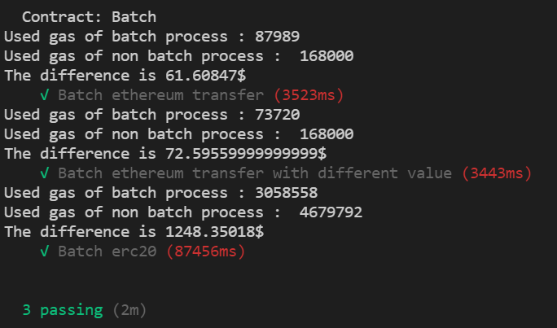

# Batch transfer of erc20, ethereum


For reduce fee, batch processing for transfer is needed.


| Name | Detail | Interface |
|---|---------|---|
| `transfer` | transfer eth multiple times with same amount | `transfer(address[] memory recipient, uint256 amount)` |
| `transferEthWithDifferentValue` | transfer eth multiple times with a different value | `transferEthWithDifferentValue(address[] memory recipient, uint256[] memory amount)` |
| `batch` | transfer erc20s multiple times with a different value | `batch(address[] memory recipient, string[] memory token, uint256[] memory amount)` |
| `addToken` | add token type to the contract | `addToken(string name, IERC20 token)` | 
| `addAdmin` | add administrator of the contract | `addAdmin(address newAdmin)` | 
| `withdraw` | withdraw erc20-token from this account | `withdraw(uint256 amount, string token)` | 
| `blockAddable` | block the feature of adding admin forever | `blockAddable()` | 


### Installation

Need to install truffle, nodejs, ganache

```
    git clone https://github.com/suhwanggyu/batch-transfer.git
    npm install
```

### Test

```
    truffle test --network ganache
```
or
```
    truffle console --network ganache
    migrate --compile-all --reset
    test
```

### Result
1. Send eth 8 times with same amount
2. Send eth 8 times with different amount
3. Send ERC20 100 times with different amount / different type of token

